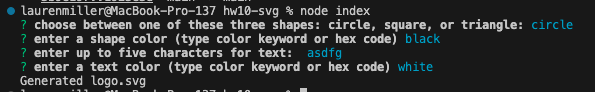

# hw10-svg

## Description

This project creates a logo comprised of 3 shape options (circle, square, or triangle) and provides the creator with the option of choosing the logo's color pallette as well as branding logo with a short string of text.

## Table of Contents

- [Installation](#installation)
- [Usage](#usage)
- [Credits](#credits)
- [License](#license)

## Installation

This project requires installations of Node.js, Jest, and Inquirer. Here's where you can download these packages:
- Node: https://nodejs.org/en/download
- Jest: https://www.npmjs.com/package/jest
- Inquirer: https://www.npmjs.com/package/inquirer/v/8.2.4  

## Usage

To get the application running, type 'node index' into your terminal and fill out the prompts in your command line to make your logo.

## Credits

Columbia University Coding Bootcamp

## License

MIT License

## How to Contribute

Keep tabs on the [Contributor Covenant](https://www.contributor-covenant.org/)!

## Tests

Tests are located in the Tests folder. There is a test for each shape class. Run the tests by typing in 'npm test' to your command line.
